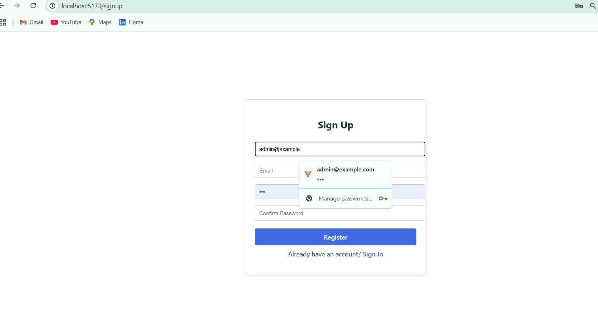
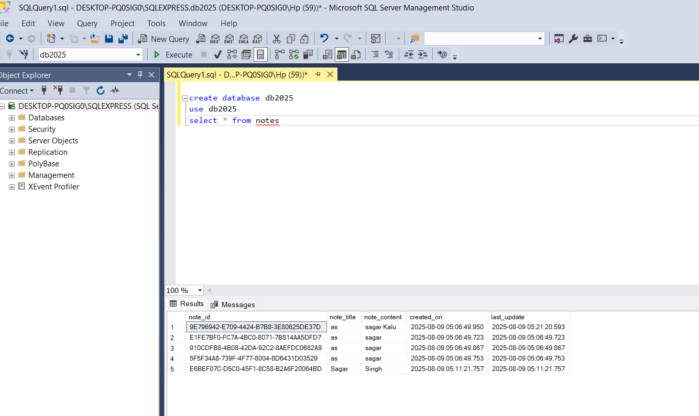
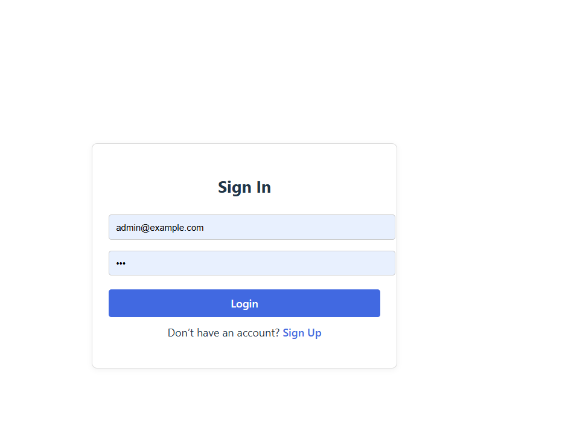

Home Page

ScreenShort

🚀 Features

- ✏ **Add new notes**
- 🔄 **Edit existing notes**
- ❌ **Delete notes**
- 📅 **Track created & updated time**
- 🌐 **API calls using Axios**
- 🔗 **SQL Server as backend storage**

## 🛠 Tech Stack

**Frontend:**
- React.js
- Axios
- React Router DOM
- CSS

**Backend:**
- FastAPI
- SQLAlchemy
- PyODBC (for SQL Server connection)
- Pydantic

**Database:**
- Microsoft SQL Server (local or remote)

Backend Setup (FastAPI + SQL Server)
Create & activate a virtual environment

cd backend
python -m venv venv
# Windows
venv\Scripts\activate

pip install fastapi uvicorn sqlalchemy pyodbc pydantic
